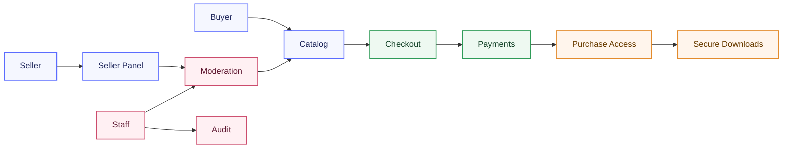

# Project Overview

## What it is

DigitalForge is a backend for a digital products marketplace.

The platform is built around one core scenario:

1. A seller creates a product and submits it for moderation.
2. A moderator reviews and publishes the product.
3. A buyer pays for the product.
4. The system grants access to files only after confirmed payment.

## Goal

The goal is to build a backend that:

- shows mature architecture
- uses a clear domain model
- accounts for security and idempotency
- is easy to review and extend

## Principles

- backend-first
- one source of truth for business rules
- strict state transitions through a service layer
- private files are never exposed via open public URLs
- purchase access is granted only after webhook confirmation

## Roles

The system should not rely on one rigid role enum.

### User capabilities

- `authenticated_user`
- `email_verified`
- `seller_enabled`
- `staff`
- `moderator`
- `admin`

## Auth strategy

For the web version in `v1`, the project uses:

- session auth in HttpOnly cookies
- CSRF protection
- secure cookie settings in production

A separate Bearer API can be added later if the project needs a dedicated SPA or external clients.

## High-level diagram

