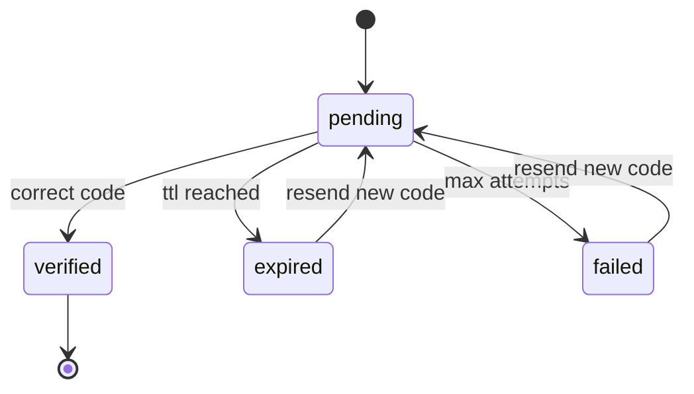
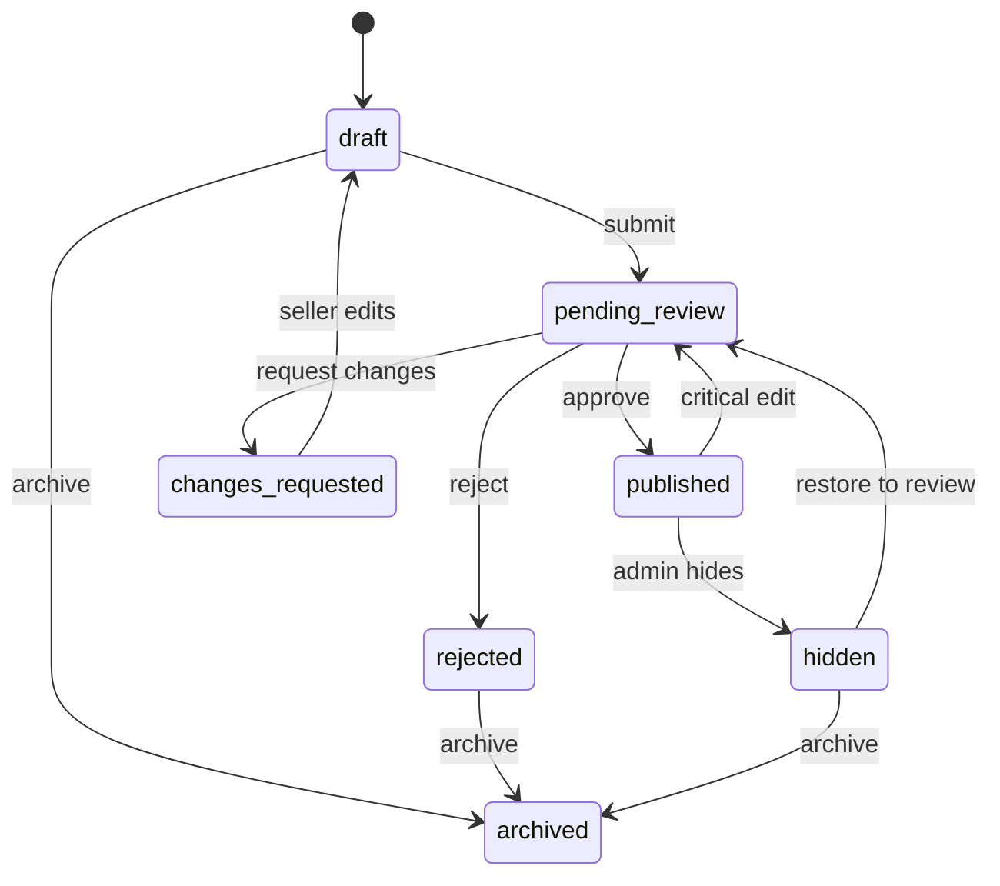
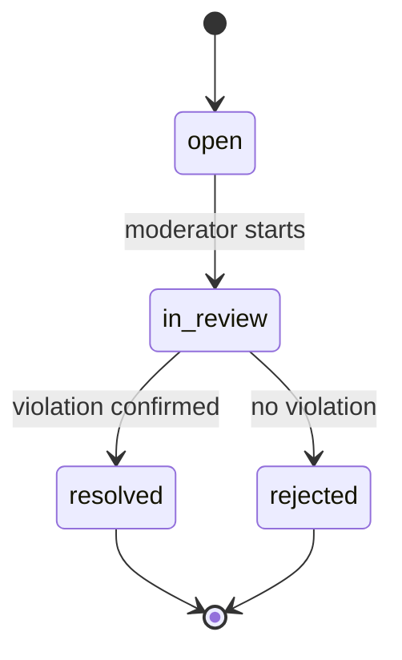

# Workflows and States

## 1. Registration and email verification

### Rules

- 5-digit code
- TTL `10 min`
- `5` attempts per code
- resend cooldown `60 sec`
- a new code invalidates the previous one

## 2. Product lifecycle

Critical edits that move a product from `published` back to `pending_review`:

- replacing or adding downloadable files
- changing the title
- changing the short or full description
- changing the category
- changing license terms
- changing the base price

Non-critical edits that may skip re-moderation:

- reordering gallery images
- fixing small typos outside the core description
- updating the changelog

## 3. Checkout and access

```mermaid
flowchart LR
    classDef order fill:#EEF9F1,stroke:#2E9B57,color:#134227;
    classDef pay fill:#EEF2FF,stroke:#5B6CFF,color:#1F275C;
    classDef secure fill:#FFF5EC,stroke:#E38B2C,color:#6A3D00;

    Cart[Cart]:::order --> Order[Order: pending_payment]:::order
    Order --> Payment[Payment: processing]:::pay
    Payment --> Webhook[Stripe webhook]:::pay
    Webhook --> Paid[Order: paid]:::order
    Paid --> Access[PurchaseAccess]:::secure
    Access --> Fulfilled[Order: fulfilled]:::order
```

## 4. Secure download

1. Buyer opens the library.
2. Buyer requests download authorization.
3. Backend checks `PurchaseAccess`.
4. Backend checks `scan_status = clean`.
5. Backend issues a short-lived signed URL.
6. Backend writes a `DownloadLog`.

## 5. Complaint flow

## 6. Refund and access policy

Flow:

1. Admin or system performs a refund.
2. Payment moves to a refund state.
3. Order updates its financial state.
4. On a full refund, the related `PurchaseAccess` is revoked.
5. The library no longer allows downloads for that product.

Rules:

- full refund -> revoke access
- partial refund -> keep access by default
- abuse cases may trigger manual revocation by admin decision
