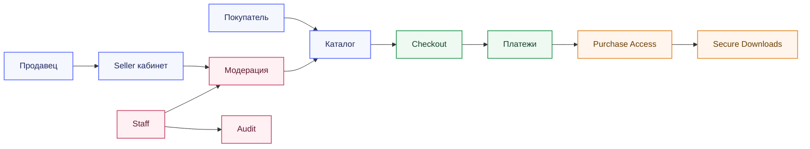

# Обзор проекта

## Что это

DigitalForge - backend для маркетплейса цифровых продуктов.

Платформа решает один основной сценарий:

1. Продавец создаёт и отправляет продукт на модерацию.
2. Модератор проверяет продукт и публикует его.
3. Покупатель оплачивает продукт.
4. Система выдаёт доступ к файлам только после подтверждённой оплаты.

## Цель проекта

Сделать backend, который:

- показывает зрелую архитектуру
- имеет понятную доменную модель
- учитывает безопасность и идемпотентность
- остаётся понятным для развития

## Основная ценность продукта

- продавцы получают управляемую публикацию и продажи
- покупатели получают безопасную покупку и скачивание
- платформа получает контроль качества и контроль рисков

## Принципы

- backend-first
- один источник истины для правил
- строгие state transitions через service layer
- приватные файлы не отдаются по публичным URL
- доступ к покупке открывается только после webhook-подтверждения

## Роли

В проекте лучше использовать не одну жёсткую роль, а набор возможностей.

### Базовые состояния пользователя

- `authenticated_user`
- `email_verified`
- `seller_enabled`
- `staff`
- `moderator`
- `admin`

### Почему так

Один enum `buyer/seller/moderator/admin` слишком ограничивает систему. В реальном продукте:

- seller тоже может покупать
- admin тоже остаётся обычным пользователем
- staff-права не должны ломать buyer-flow

## Auth strategy

Для web-версии в `v1` выбираем один конкретный подход:

- session auth в HttpOnly cookies
- CSRF protection
- secure cookie settings в production

Отдельный Bearer API можно добавить позже, если появится отдельный SPA или внешний клиент.

## Money flow

Даже без payouts в `v1` надо сразу фиксировать финансовую модель:

- buyer платит платформе
- платформа удерживает комиссию
- у заказа есть зафиксированный pricing snapshot
- у каждой позиции заказа есть `platform_fee_amount` и `seller_net_amount`

## High-level схема

