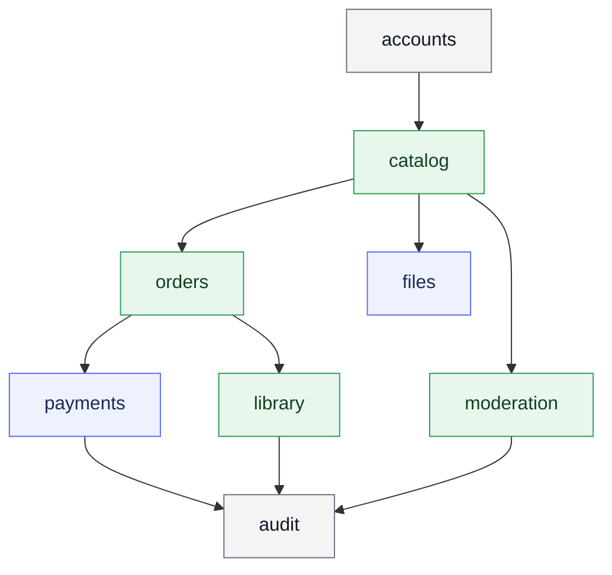

# Архитектура

## Стек

- Django
- Django REST Framework
- PostgreSQL
- Redis
- Celery
- Stripe
- S3-compatible object storage

## Главный подход

- thin API layer
- service layer для изменений состояния
- selectors для чтения
- models для структуры данных и базовых инвариантов

## Структура репозитория

```text
digitalforge/
├─ backend/
│  ├─ apps/
│  │  ├─ accounts/
│  │  ├─ catalog/
│  │  ├─ files/
│  │  ├─ moderation/
│  │  ├─ orders/
│  │  ├─ payments/
│  │  ├─ library/
│  │  ├─ complaints/
│  │  ├─ notifications/
│  │  ├─ audit/
│  │  └─ common/
│  ├─ config/
│  └─ manage.py
├─ docs/
│  ├─ ru/
│  └─ en/
└─ README.md
```

## App boundaries

### `accounts`

- user
- profile
- email verification
- password reset
- auth sessions

### `catalog`

- product
- category
- tag
- public listing
- seller editing

### `files`

- file metadata
- image metadata
- storage integration
- scan status

### `moderation`

- product review queue
- moderation actions
- hide and restore flows

### `orders`

- cart
- order
- order item
- checkout snapshot

### `payments`

- payment attempts
- Stripe session
- webhook events
- refunds

### `library`

- purchase access
- library listing
- secure download authorization

## Dependency direction


