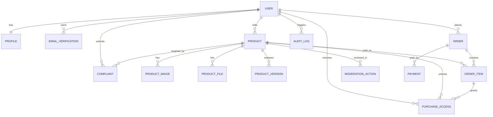

# Домен и данные

## Общие правила

- все primary key - UUID
- статусы описываются через choices
- критичные переходы только через service layer
- soft delete используется только там, где это реально нужно

## Основные сущности

### User

- `email`
- `username`
- `password_hash`
- `is_active`
- `email_verified`
- `is_seller`
- `is_staff`
- `is_moderator`
- `is_admin`

### Profile

- `display_name`
- `avatar_url`
- `bio`
- `country`
- `timezone`
- `locale`

### EmailVerification

- `user_id`
- `code_hash`
- `status`
- `attempts_count`
- `expires_at`
- `resend_available_at`
- `used_at`

### Product

- `seller_id`
- `category_id`
- `title`
- `slug`
- `short_description`
- `full_description`
- `product_type`
- `base_price`
- `currency`
- `status`
- `moderation_note`
- `published_at`
- `hidden_at`
- `archived_at`

### ProductImage

- `product_id`
- `image_url`
- `kind`
- `sort_order`

`kind`:

- `cover`
- `gallery`

### ProductFile

- `product_id`
- `file_name`
- `storage_key`
- `mime_type`
- `file_size`
- `checksum`
- `scan_status`
- `is_current`

### ProductVersion

- `product_id`
- `version_label`
- `changelog`
- `released_at`

### Cart

- `user_id`

### CartItem

- `cart_id`
- `product_id`
- `created_at`

### Order

- `buyer_id`
- `order_number`
- `status`
- `subtotal_amount`
- `platform_fee_amount`
- `total_amount`
- `currency`
- `paid_at`
- `fulfilled_at`
- `canceled_at`

### OrderItem

- `order_id`
- `product_id`
- `seller_id`
- `unit_price`
- `final_price`
- `platform_fee_amount`
- `seller_net_amount`

### Payment

- `order_id`
- `provider`
- `provider_payment_id`
- `status`
- `amount`
- `currency`
- `failure_code`
- `failure_reason`
- `refunded_amount`
- `processed_at`

### PaymentWebhookEvent

- `provider`
- `event_id`
- `event_type`
- `payload`
- `is_processed`
- `processed_at`

### PurchaseAccess

- `order_item_id`
- `buyer_id`
- `product_id`
- `is_active`
- `granted_at`
- `revoked_at`

Политика возврата для `v1`:

- full refund -> доступ отзывается
- partial refund -> доступ сохраняется по умолчанию
- admin может вручную отозвать доступ по abuse case

### DownloadLog

- `user_id`
- `product_id`
- `product_file_id`
- `ip_address`
- `user_agent`
- `success`

### ModerationAction

- `product_id`
- `actor_user_id`
- `from_status`
- `to_status`
- `reason`

### Complaint

- `submitted_by_id`
- `product_id`
- `status`
- `reason`
- `details`
- `assigned_to_id`
- `resolution_comment`
- `resolved_at`

### Notification

- `user_id`
- `type`
- `title`
- `body`
- `is_read`

### AuditLog

- `actor_user_id`
- `action_type`
- `entity_type`
- `entity_id`
- `metadata`
- `ip_address`

## State sets

### Product status

- `draft`
- `pending_review`
- `changes_requested`
- `published`
- `rejected`
- `hidden`
- `archived`

### Order status

- `created`
- `pending_payment`
- `paid`
- `fulfilled`
- `failed`
- `canceled`
- `refunded`
- `partially_refunded`

### Payment status

- `initiated`
- `processing`
- `succeeded`
- `failed`
- `canceled`
- `refunded`
- `partially_refunded`
- `disputed`

## Ключевые ограничения

- `User.email` unique
- `User.username` unique
- `Product.slug` unique
- `Order.order_number` unique
- `CartItem(cart_id, product_id)` unique
- `OrderItem(order_id, product_id)` unique
- `PurchaseAccess(buyer_id, product_id)` unique
- `PaymentWebhookEvent(provider, event_id)` unique

## ER-схема

