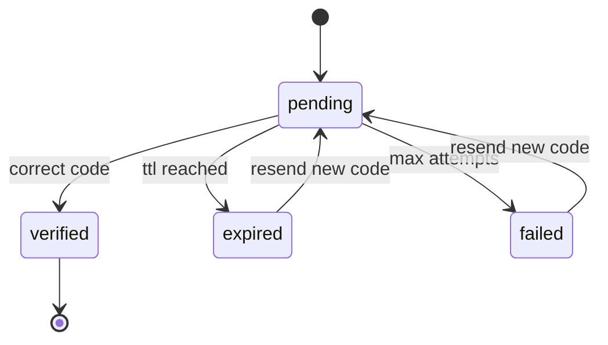
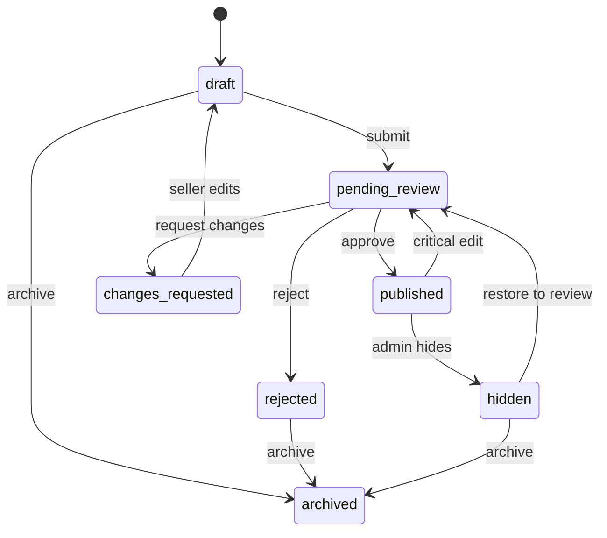
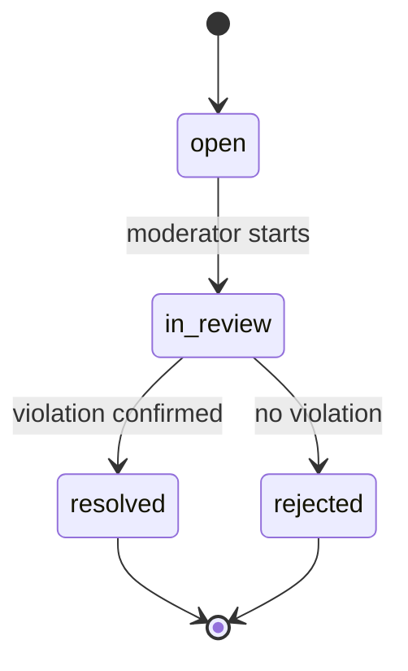

# Сценарии и состояния

## 1. Регистрация и подтверждение email

### Flow

1. Пользователь регистрируется.
2. Система создаёт `EmailVerification`.
3. Код отправляется через очередь.
4. Пользователь вводит код.
5. При успехе `email_verified = true`.

### Правила

- код 5-значный
- TTL `10 min`
- максимум `5` попыток
- resend cooldown `60 sec`
- новый код инвалидирует предыдущий

## 2. Product lifecycle

### Важные правила

- seller не публикует продукт напрямую
- критичное изменение опубликованного продукта запускает повторную модерацию
- публично виден только `published`

### Critical edit rules

Следующие изменения считаются критичными и переводят продукт из `published` в `pending_review`:

- замена или добавление downloadable files
- изменение title
- изменение short description или full description
- изменение category
- изменение license terms
- изменение base price

Следующие изменения считаются некритичными и могут не запускать повторную модерацию:

- перестановка gallery
- исправление мелких опечаток вне core description
- техническое обновление changelog

## 3. Checkout и доступ

```mermaid
flowchart LR
    classDef order fill:#EEF9F1,stroke:#2E9B57,color:#134227;
    classDef pay fill:#EEF2FF,stroke:#5B6CFF,color:#1F275C;
    classDef secure fill:#FFF5EC,stroke:#E38B2C,color:#6A3D00;

    Cart[Cart]:::order --> Order[Order: pending_payment]:::order
    Order --> Payment[Payment: processing]:::pay
    Payment --> Webhook[Stripe webhook]:::pay
    Webhook --> Paid[Order: paid]:::order
    Paid --> Access[PurchaseAccess]:::secure
    Access --> Fulfilled[Order: fulfilled]:::order
```

### Правила

- доступ не создаётся по клиентскому redirect
- доступ создаётся только по webhook
- webhook должен быть идемпотентным

## 4. Secure download

1. Buyer открывает библиотеку.
2. Запрашивает download authorization.
3. Backend проверяет `PurchaseAccess`.
4. Backend проверяет `scan_status = clean`.
5. Генерируется signed URL.
6. Создаётся `DownloadLog`.

## 5. Complaint flow

## 6. Refund and access policy

### Flow

1. Admin или system выполняет refund.
2. Payment получает refund state.
3. Order обновляет финансовый статус.
4. При full refund связанный `PurchaseAccess` отзывается.
5. Библиотека больше не даёт скачать продукт.

### Rules

- full refund -> revoke access
- partial refund -> access stays active by default
- abuse case может привести к manual revoke по admin decision
